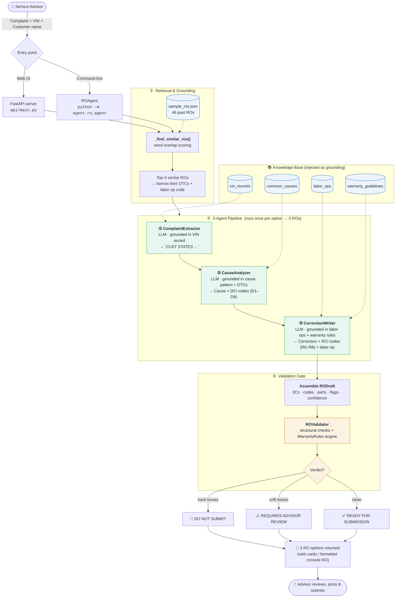

<div align="center">

# 🔧 BMW Repair Order Agent

**An AI pipeline that turns a technician's rough notes into a warranty-compliant BMW Repair Order — and tells you whether it will pass the claim desk before you submit it.**

[](https://www.python.org/)
[](https://fastapi.tiangolo.com/)
[](https://groq.com/)
[]()

</div>

---

## Table of Contents

- [The Problem](#the-problem)
- [What It Does](#what-it-does)
- [Key Concepts (60-second primer)](#key-concepts-60-second-primer)
- [How It Works — Workflow](#how-it-works--workflow)
- [Walkthrough of the Pipeline](#walkthrough-of-the-pipeline)
- [Project Structure](#project-structure)
- [Tech Stack](#tech-stack)
- [Getting Started](#getting-started)
- [Usage](#usage)
- [The Knowledge Base](#the-knowledge-base)
- [Validation Rules](#validation-rules)
- [Roadmap](#roadmap)
- [Disclaimer](#disclaimer)

---

## The Problem

When a BMW dealership submits a warranty claim, the **Repair Order (RO)** has to be written in a very specific way. BMW rejects claims for documentation reasons all the time: the complaint contains diagnosis language, the cause is missing a **DCI** diagnostic code, the correction has no **RCI** code or labor operation, fluids were logged without a quantity, and so on.

Advisors and technicians lose hours rewriting ROs, and rejected claims mean unpaid labor. The rules are knowable — they're just tedious and easy to miss.

## What It Does

This project automates the write-up. A user types a plain-language complaint, a VIN, and the customer's name. The agent:

1. **Finds the 3 most similar past repair orders** to ground its answer in real dealership history.
2. **Runs a 3-agent LLM pipeline** that writes each of the "Three Cs" — **C**omplaint, **C**ause, **C**orrection — in BMW's required format, grounded in actual vehicle and labor data (not hallucinated).
3. **Validates every draft** against BMW's structural rules and warranty guidelines, returning a clear verdict: **`READY FOR SUBMISSION`**, **`REQUIRES ADVISOR REVIEW`**, or **`DO NOT SUBMIT`**.
4. **Returns 3 complete RO options** — with codes, labor, parts, cost summary, flags, and confidence scores — for the advisor to pick from.

You get a submission-ready repair order in seconds, with a second pair of eyes that knows the warranty rulebook.

---

## Key Concepts (60-second primer)

| Term | What it means |
|------|---------------|
| **The Three Cs** | Every RO has a **Complaint** (what the customer experienced), a **Cause** (what the technician found), and a **Correction** (what was done). Mixing them up — e.g. diagnosis in the Complaint — gets claims rejected. |
| **DCI codes** (`D1`–`D8`) | BMW **Diagnosis Category Identifiers**. The *Cause* must reference one (per BMW SIB 01 01 20). |
| **RCI codes** (`R0`–`R8`) | BMW **Repair Category Identifiers**. The *Correction* must reference one. |
| **Labor Op Code** | A BMW flat-rate operation code (e.g. `61 21 050`) that tells the claim desk what was done and how long it should take. |
| **DTC** | **Diagnostic Trouble Code** from the scan tool (e.g. `P0301`). Used to match the right cause pattern. |
| **Grounding** | Instead of trusting the LLM's memory, every prompt is injected with real records (VIN, cause patterns, labor ops, rules) so output is based on dealership data. |

---

## How It Works — Workflow

The system is a **retrieve → generate → validate** pipeline. One complaint produces three independently grounded, independently validated repair orders.



---

## Walkthrough of the Pipeline

Each numbered stage in the diagram maps directly to code:

### ① Retrieval & Grounding — `ROAgent._find_similar_ros()`
Tokenizes the incoming complaint (ignoring words under 4 characters), scores every record in `sample_ros.json` by word overlap, and returns the **top 3**. Each match donates its real `dtc_codes` and `labor_op_code` so the generated RO is anchored to a repair that was actually performed. This is why one complaint yields **three** distinct options.

### ② The 3-Agent Pipeline — `ROAgent.generate()`
Three specialized agents run in sequence, each playing a BMW role and each producing one of the Three Cs. Every prompt is injected with the relevant knowledge record so the model writes from data, not memory.

| Agent | Role | Output | Grounded in |
|-------|------|--------|-------------|
| `ComplaintExtractor` | Service Documentation Specialist | Complaint starting with **`CUST STATES`**, zero diagnosis language | `vin_records.json` |
| `CauseAnalyzer` | Master Diagnostic Technician | Cause statement + **DCI codes** (`D1`–`D8`) | `common_causes.json` + DTCs |
| `CorrectionWriter` | Warranty Language Specialist | Correction + **RCI codes** (`R0`–`R8`) + labor op | `labor_ops.json` + `warranty_guidelines.json` |

The results are assembled into a single **`RODraft`** dataclass holding the 3Cs, all codes, parts, labor hours, per-field confidence scores, and any flags raised along the way.

### ③ Validation Gate — `ROValidator.validate()`
The draft passes through two layers of checking before it's trusted:

1. **Structural checks** — Does the Complaint start with `CUST STATES`? Is it ≥ 10 words and free of diagnosis language? Does the Cause carry a DCI code and reference a DTC or inspection? Does the Correction carry an RCI code and a valid labor op?
2. **Warranty rule engine** (`WarrantyRules`) — runs the text against BMW claim rules (OEM parts only, fluids logged with quantities, programming logged with I-Level, etc.).

Issues are graded **hard** (claim-killing) or **soft** (review recommended), producing the final verdict shown on each RO.

---

## Project Structure

```
BMW_RO_Project/
├── agent/                      # 🧠 The AI pipeline (core of the project)
│   ├── ro_agent.py             #    Orchestrator — runs the 3 agents, renders the RO
│   ├── complaint_extractor.py  #    ① Complaint  (CUST STATES…)
│   ├── cause_analyzer.py       #    ② Cause      (DCI codes)
│   ├── correction_writer.py    #    ③ Correction (RCI codes + labor op)
│   ├── ro_validator.py         #    Final validation gate → verdict
│   └── prompts.py              #    Versioned prompt library (all prompt text lives here)
│
├── knowledge/                  # 📚 Domain knowledge & rules
│   ├── warranty_rules.py       #    Rule engine used by the validator
│   └── data/                   #    Grounding data injected into prompts:
│       ├── vin_records.json        #    25 vehicles
│       ├── common_causes.json      #    35 symptom → cause/correction patterns
│       ├── labor_ops.json          #    79 BMW labor operation codes
│       ├── sample_ros.json         #    46 historical repair orders
│       └── warranty_guidelines.json#    20 warranty claim rules
│
├── api/
│   └── main.py                 # 🌐 FastAPI server — serves the UI + /api/generate
│
├── ui/
│   └── index.html              # 💻 Single-page web front-end (BMW-styled)
│
├── input/
│   └── dtc_parser.py           # 🔌 Scan-tool DTC parsing utilities
│
├── requirements.txt
└── readme.md
```

> **Note on scaffolding.** Several files exist as empty placeholders for planned features — see the [Roadmap](#roadmap). The list above shows the **implemented** modules.

---

## Tech Stack

| Layer | Technology |
|-------|-----------|
| **Language** | Python 3.10+ |
| **LLM** | `llama-3.3-70b-versatile` via [Groq](https://groq.com/) (fast inference) |
| **Web API** | FastAPI + Uvicorn |
| **Front-end** | Vanilla HTML/CSS/JS single-page app (`ui/index.html`) |
| **Config** | `python-dotenv` (`.env`) |
| **Knowledge base** | Local JSON files (no database required to run) |

---

## Getting Started

### Prerequisites
- Python **3.10 or newer**
- A free [Groq API key](https://console.groq.com/keys)

### 1. Clone & install

```bash
git clone <your-repo-url>
cd BMW_RO_Project

python -m venv .venv
# Windows (PowerShell)
.\.venv\Scripts\Activate.ps1
# macOS / Linux
source .venv/bin/activate

pip install -r requirements.txt
```

### 2. Configure your API key

Create a `.env` file in the project root:

```env
GROQ_API_KEY=your_groq_api_key_here
```

### 3. Run it

```bash
uvicorn api.main:app --reload --port 8000
```

Then open **http://localhost:8000** in your browser.

---

## Usage

### 🌐 Web UI
Open `http://localhost:8000`, enter a complaint, pick or type a VIN (the UI offers a quick-pick list of known vehicles via `/api/vehicles`), add the customer name, and click generate. You'll get up to three RO cards, each with the 3Cs, codes, a cost summary, flags, and a submission verdict.

### 🖥️ Command Line
Run the pipeline directly and see the fully formatted BMW Repair Order printed to the console:

```bash
# Interactive — prompts for complaint, name, VIN
python -m agent.ro_agent

# Or pass arguments directly
python -m agent.ro_agent "Engine misfires and shakes at idle, check engine light on" "Jane Doe" WBA5R7C50KAJ12345
```

### 🔌 API

| Method | Endpoint | Description |
|--------|----------|-------------|
| `GET`  | `/` | Serves the single-page web UI |
| `GET`  | `/api/vehicles` | Lists known VINs for the UI's quick-pick datalist |
| `POST` | `/api/generate` | Runs the full pipeline; returns up to 3 RO options |

**Example request**

```bash
curl -X POST http://localhost:8000/api/generate \
  -H "Content-Type: application/json" \
  -d '{
        "customer_name": "Jane Doe",
        "vin": "WBA5R7C50KAJ12345",
        "complaint": "Engine misfires and shakes at idle, check engine light on"
      }'
```

The response includes each option's `complaint` / `cause` / `correction`, `dci_codes`, `rci_codes`, `labor_op_code`, `labor_hours`, a `financials` block (labor + parts + HST at 13%, $125/hr labor rate), `flags`, `confidence`, and a `validation` verdict.

---

## The Knowledge Base

All grounding data lives in `knowledge/data/` as plain JSON, so the system runs with no database and is easy to inspect or extend:

| File | Records | Purpose |
|------|--------:|---------|
| `vin_records.json` | 25 | Vehicle, owner, and warranty details — grounds the Complaint |
| `common_causes.json` | 35 | Symptom → cause/correction patterns matched by DTC or keyword |
| `labor_ops.json` | 79 | BMW labor operation codes, flat-rate hours, warranty eligibility |
| `sample_ros.json` | 46 | Historical repair orders used for similarity retrieval |
| `warranty_guidelines.json` | 20 | The warranty rulebook the validator enforces |

To adapt the agent to your own dealership data, edit these files — no code changes required.

---

## Validation Rules

The validator grades issues by severity, which drives the final verdict:

| Verdict | Meaning |
|---------|---------|
| ✅ `READY FOR SUBMISSION` | No issues — claim-ready |
| ⚠️ `REQUIRES ADVISOR REVIEW` | Only soft issues — review recommended |
| 🛑 `DO NOT SUBMIT — CRITICAL ISSUES` | One or more hard issues — claim would be rejected |

Representative checks:

- **Complaint** must begin with `CUST STATES`, be ≥ 10 words, and contain no diagnosis language.
- **Cause** must reference a DCI code (`D1`–`D8`) and either a DTC or an inspection finding.
- **Correction** must reference an RCI code (`R0`–`R8`) and a valid labor operation code.
- **Warranty rules** (sample): OEM parts only, fluids logged with a quantity, programming logged with an I-Level, diagnosis over 5 FRU requires detailed notes.

---

## Roadmap

The repository includes placeholders for the next phases of development:

- [ ] **Voice capture** — speak the complaint instead of typing it (`elevenlabs` + `sounddevice` are already in `requirements.txt`; `ui/VoiceCapture.jsx`)
- [ ] **React front-end** — migrate `ui/index.html` into components (`App.jsx`, `ROForm.jsx`, `ROPreview.jsx`, `ValidationPanel.jsx`)
- [ ] **Persistence layer** — store generated ROs (`db/schema.sql`, `db/ro_repository.py`)
- [ ] **Auth & modular routes** — `api/auth.py`, `api/models.py`, `api/routes.py`
- [ ] **Live data connectors** — DMS integration and VIN decoding (`input/dms_connector.py`, `input/vin_decoder.py`)
- [ ] **Parts lookup & labor-op helpers** — `knowledge/parts_lookup.py`, `knowledge/labor_ops.py`
- [ ] **Test suite** — `tests/test_3c_extraction.py`, `tests/test_validator.py`
- [ ] **Containerization** — `docker-compose.yml`

---

## Disclaimer

This is an **independent prototype** built for demonstration and educational purposes. It is **not affiliated with, endorsed by, or an official product of BMW AG**. "BMW" and related marks belong to their respective owners. Generated repair orders should always be reviewed by a qualified service advisor before any warranty submission.
