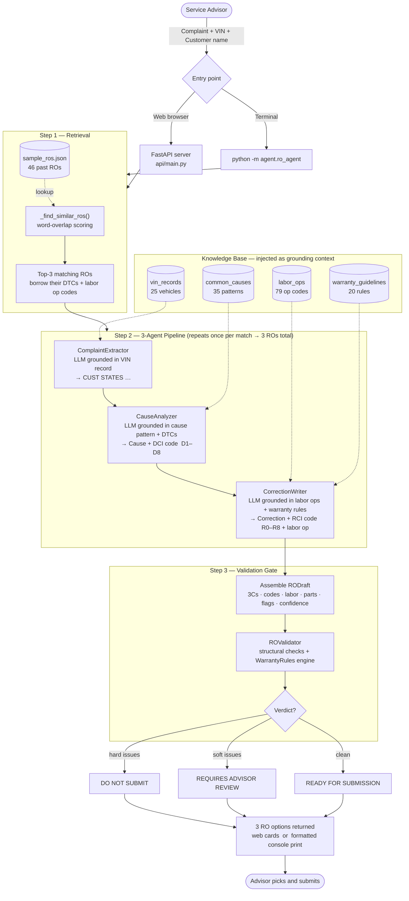

<div align="center">

# BMW Repair Order Agent

**An AI pipeline that turns a technician's rough notes into a warranty-compliant BMW Repair Order — grounded in real dealership data, validated against BMW's claim rules before you ever hit submit.**

[](https://www.python.org/)
[](https://fastapi.tiangolo.com/)
[](https://groq.com/)
[]()
[]()

</div>

---

## Table of Contents

- [The Problem](#the-problem)
- [How It Works](#how-it-works)
- [Pipeline Walkthrough](#pipeline-walkthrough)
- [Sample Output](#sample-output)
- [Project Structure](#project-structure)
- [Tech Stack](#tech-stack)
- [Getting Started](#getting-started)
- [Usage](#usage)
- [The Knowledge Base](#the-knowledge-base)
- [Validation Rules](#validation-rules)
- [Key Concepts](#key-concepts)
- [Roadmap](#roadmap)
- [Disclaimer](#disclaimer)

---

## The Problem

BMW warranty claims live or die on paperwork. The **Repair Order (RO)** must follow BMW's *Three Cs* format — **Complaint, Cause, Correction** — with strict requirements at every level: the Complaint must begin with `CUST STATES` and contain zero diagnosis language, the Cause must carry a BMW **DCI** code, the Correction must reference an **RCI** code and a valid flat-rate labor operation. Mix any of this up and the claim desk sends it back unpaid.

Technicians and advisors lose hours rewriting ROs. The rules are fully knowable — they're just tedious, and one missed code means wasted labor. This project automates the write-up entirely.

---

## How It Works

The system is a **retrieve → generate → validate** loop. One complaint produces **three** independently grounded, independently validated RO options for the advisor to choose from.



---

## Pipeline Walkthrough

### Step 1 — Retrieval: `ROAgent._find_similar_ros()`

The incoming complaint is tokenized (words ≥ 4 characters), then scored against all 46 records in `sample_ros.json` by word overlap. The **top 3** matching historical ROs are returned. Each match donates its real `dtc_codes` and `labor_op_code` — so the generated RO is anchored to a repair that was actually performed at a BMW dealership. This is why one complaint always produces **three distinct** options.

### Step 2 — The 3-Agent Pipeline: `ROAgent.generate()`

Three specialized LLM agents run sequentially. Each plays a specific BMW role and writes exactly one of the Three Cs. Every prompt is injected with the relevant knowledge record so the model produces answers from data, not memory.

| Agent | Role | Output | Grounded in |
|-------|------|--------|-------------|
| `ComplaintExtractor` | Service Documentation Specialist | Complaint starting `CUST STATES` — no diagnosis language | `vin_records.json` |
| `CauseAnalyzer` | Master Diagnostic Technician | Cause statement + **DCI code** (`D1`–`D8`) | `common_causes.json` + DTCs |
| `CorrectionWriter` | Warranty Language Specialist | Correction + **RCI code** (`R0`–`R8`) + labor op code | `labor_ops.json` + `warranty_guidelines.json` |

The three outputs are assembled into a single **`RODraft`** dataclass holding the 3Cs, all BMW codes, parts, labor hours, per-field confidence scores, and any flags raised during generation.

### Step 3 — Validation Gate: `ROValidator.validate()`

Two layers of checking before the RO is trusted:

1. **Structural checks (SIB 01 01 20)** — does the Complaint start with `CUST STATES` and contain ≥ 10 words with no diagnosis language? Does the Cause carry a DCI code and reference a DTC or inspection finding? Does the Correction carry an RCI code and a valid labor op?
2. **Warranty rule engine** (`WarrantyRules`) — text-scans the correction against BMW claim rules: OEM parts only, fluids logged with quantities, programming documented with I-Level, and more.

Each issue is graded **hard** (claim-killing, do not submit) or **soft** (review recommended), producing the final verdict attached to each RO.

---

## Sample Output

Below is a real output from the pipeline — **Option 1 of 3**, verdict `READY FOR SUBMISSION`:

```
  CUSTOMER: David Vance                             VIN:         WBA51AW00MGG24101
  CELL:     416-555-0142                            YEAR/MODEL:  2021 BMW 330i
  EMAIL:    dvance@example.net                      PROD DATE:   2021-08-14
                                          ODOMETER IN:  34,200 km

  LINE A: WARRANTY REPAIR

  COMPLAINT:
    CUST STATES that they have noticed an oil leak under their vehicle,
    accompanied by a burning smell when the engine is idling.

  CAUSE:
    D2. Visual inspection confirmed oil leak under the vehicle, accompanied
    by a burning smell when the engine is idling, consistent with a cracked
    composite cylinder head cover assembly leaking onto the hot exhaust
    manifold shield surface.

  CORRECTION:
    R2 Cylinder Head Cover Assembly.
    Labor op 11 12 000.
    Removed old cylinder head cover. Cleaned cylinder head sealing surface.
    Replaced defective cylinder head cover assembly and perimeter rubber
    gasket. Torqued to factory specifications. Verified engine oil level
    and performed road test to confirm leak is completely resolved.

  LABOR CODE      DESCRIPTION                         FRU/HRS    AMOUNT
  11 12 000       Warranty Repair Labor                   3.8    $  475.00
  ─────────────────────────────────────────────────────────────────────
  SUBTOTAL                                                       $   475.00
  HST (13%)                                                      $    61.75
  TOTAL AMOUNT DUE                                               $   536.75

  [OK] No flags detected — RO is ready for submission.
  CONFIDENCE:  Complaint 100%  |  Cause 100%  |  Correction 100%
```

---

## Project Structure

```
BMW_RO_Project/
│
├── agent/                          # AI pipeline — core of the project
│   ├── ro_agent.py                 #   Orchestrator: retrieval, generation, rendering
│   ├── complaint_extractor.py      #   Step ①: writes CUST STATES complaint
│   ├── cause_analyzer.py           #   Step ②: writes cause + DCI code
│   ├── correction_writer.py        #   Step ③: writes correction + RCI code + labor op
│   ├── ro_validator.py             #   Final gate: structural + warranty rule checks
│   └── prompts.py                  #   All versioned prompt templates (one source of truth)
│
├── knowledge/                      # Domain knowledge injected as grounding
│   ├── warranty_rules.py           #   Warranty rule engine used by the validator
│   └── data/
│       ├── vin_records.json        #   25 vehicles (year, model, engine, warranty, owner)
│       ├── common_causes.json      #   35 fault patterns matched by DTC or keyword
│       ├── labor_ops.json          #   79 BMW flat-rate operation codes
│       ├── sample_ros.json         #   46 historical repair orders for retrieval
│       └── warranty_guidelines.json#   20 BMW warranty claim rules
│
├── api/
│   └── main.py                     # FastAPI server — /api/generate, /api/vehicles, UI
│
├── ui/
│   └── index.html                  # Single-page BMW-styled web front-end
│
├── input/
│   └── dtc_parser.py               # Scan-tool DTC parsing utilities
│
├── requirements.txt
└── readme.md
```

> Several additional files exist as scaffolding for planned features. See [Roadmap](#roadmap) for details.

---

## Tech Stack

| Layer | Technology |
|-------|-----------|
| Language | Python 3.10+ |
| LLM | `llama-3.3-70b-versatile` via [Groq](https://groq.com/) |
| Web API | FastAPI + Uvicorn |
| Front-end | Vanilla HTML/CSS/JS single-page app |
| Config | `python-dotenv` |
| Knowledge base | Local JSON files — no database required |

---

## Getting Started

### Prerequisites

- Python **3.10** or newer
- A free [Groq API key](https://console.groq.com/keys)

### 1 — Clone and install

```bash
git clone <your-repo-url>
cd BMW_RO_Project

python -m venv .venv

# Windows (PowerShell)
.\.venv\Scripts\Activate.ps1
# macOS / Linux
source .venv/bin/activate

pip install -r requirements.txt
```

### 2 — Add your API key

Create a `.env` file in the project root:

```env
GROQ_API_KEY=your_groq_api_key_here
```

### 3 — Run

```bash
uvicorn api.main:app --reload --port 8000
```

Open **http://localhost:8000** in your browser.

---

## Usage

### Web UI

Navigate to `http://localhost:8000`. Enter a customer complaint, pick or type a VIN (a live datalist is populated from `/api/vehicles`), and enter the customer name. Click **Generate** to receive up to three RO cards, each displaying the Three Cs, BMW codes, a cost summary, flags, and a submission verdict.

### Command Line

The pipeline can run entirely from the terminal — useful for quick testing or batch generation:

```bash
# Interactive — prompts for each field
python -m agent.ro_agent

# Pass all three arguments directly
python -m agent.ro_agent \
  "Engine oil leak with burning smell at idle, oil puddling under vehicle" \
  "David Vance" \
  WBA51AW00MGG24101
```

Each of the three generated ROs prints as a formatted repair order with a validation report below it.

### REST API

| Method | Endpoint | Description |
|--------|----------|-------------|
| `GET` | `/` | Serves the single-page web UI |
| `GET` | `/api/vehicles` | Returns known VINs for the datalist |
| `POST` | `/api/generate` | Runs the full pipeline; returns up to 3 RO options as JSON |

**Example `POST /api/generate` request:**

```bash
curl -X POST http://localhost:8000/api/generate \
  -H "Content-Type: application/json" \
  -d '{
        "customer_name": "David Vance",
        "vin": "WBA51AW00MGG24101",
        "complaint": "Engine oil leak with burning smell at idle, oil puddling under vehicle"
      }'
```

Each option in the response includes: `complaint`, `cause`, `correction`, `dci_codes`, `rci_codes`, `labor_op_code`, `labor_hours`, `financials` (labor + parts + HST at 13%, $125/hr rate), `flags`, `confidence`, and a `validation` block with the full verdict.

---

## The Knowledge Base

Everything in `knowledge/data/` is a plain JSON file — no database, no external service. To adapt the agent to a specific dealership, edit these files directly; no code changes are needed.

| File | Records | Role in the pipeline |
|------|--------:|---------------------|
| `vin_records.json` | 25 | Vehicle, owner, and warranty data — grounds the Complaint |
| `common_causes.json` | 35 | Symptom → fault patterns, matched by DTC code or keyword |
| `labor_ops.json` | 79 | BMW flat-rate op codes, hours, and warranty eligibility flags |
| `sample_ros.json` | 46 | Historical ROs used for similarity retrieval and grounding |
| `warranty_guidelines.json` | 20 | The warranty rulebook the validator enforces |

### How cause matching works

`CauseAnalyzer` matches the incoming complaint to a pattern in `common_causes.json` using a three-priority system:

1. **P1 — DTC exact match**: if a scan-tool code (e.g. `140010`, `P0303`) appears in the complaint, match the pattern that lists it.
2. **P2 — Phrase/keyword match**: score the complaint against each pattern's `symptom_keywords` list. Highest-scoring pattern wins.
3. **P3 — Word-level fallback**: if no P2 match scores above zero, decompose both the complaint and keywords into individual words (≥ 5 chars) and match on overlap.

The matched pattern's `suggested_cause` and `suggested_correction` are injected verbatim into the LLM prompts as the primary reference.

---

## Validation Rules

| Verdict | Meaning |
|---------|---------|
| `READY FOR SUBMISSION` | No structural or warranty issues — claim-ready |
| `REQUIRES ADVISOR REVIEW` | Soft issues only — review recommended before submitting |
| `DO NOT SUBMIT — CRITICAL ISSUES` | One or more hard issues — BMW would reject this claim |

**Structural checks (hard by default):**

- Complaint must begin with `CUST STATES`, be ≥ 10 words, contain no diagnosis language
- Cause must contain a DCI code (`D1`–`D8`) and reference either a DTC or an inspection finding
- Correction must contain an RCI code (`R0`–`R8`) and a valid labor operation code

**Warranty rule checks (from `warranty_guidelines.json`):**

- `WR-001` — No empty or boilerplate fields
- `WR-003` — OEM parts only (aftermarket language triggers rejection)
- `WR-011` — Software/programming repairs must log the I-Level
- `WR-013` — Fluid additions must include a quantity

---

## Key Concepts

| Term | Meaning |
|------|---------|
| **Three Cs** | Every BMW RO has a **Complaint** (customer experience), **Cause** (technician finding), and **Correction** (work performed). Mixing them — e.g. diagnosis in the Complaint — is an automatic rejection. |
| **DCI codes** `D1–D8` | BMW **Diagnosis Category Identifiers**. Required on the Cause field per SIB 01 01 20. `D1` = scan tool fault code, `D2` = visual inspection, `D3` = visual + measurement, etc. |
| **RCI codes** `R0–R8` | BMW **Repair Category Identifiers**. Required on the Correction field. `R2` = part replaced, `R3` = campaign/SIB, `R5` = control unit programmed, etc. |
| **Labor op code** | A BMW flat-rate code (e.g. `11 12 000`) that tells the claim desk exactly what was done and how long it should take. |
| **DTC** | **Diagnostic Trouble Code** from the scan tool (e.g. `P0303`, `140010`). Used in P1 cause matching. |
| **Grounding** | Instead of relying on LLM memory, every prompt is injected with real records (VIN data, fault patterns, labor op codes, warranty rules) so the model writes from your data, not its training weights. |

---

## Roadmap

| Feature | Status | Notes |
|---------|--------|-------|
| 3-agent pipeline (CLI) | Done | Core pipeline, fully functional |
| Retrieval-grounded generation | Done | Top-3 similarity search over 46 sample ROs |
| Validation gate | Done | Structural + warranty rule checks |
| Web UI + FastAPI server | Done | `http://localhost:8000` |
| Voice capture | Planned | `elevenlabs` + `sounddevice` in requirements; `ui/VoiceCapture.jsx` scaffolded |
| React front-end | Planned | `App.jsx`, `ROForm.jsx`, `ROPreview.jsx`, `ValidationPanel.jsx` scaffolded |
| Persistence layer | Planned | `db/ro_repository.py` scaffolded |
| Auth + modular routes | Planned | `api/auth.py`, `api/routes.py` scaffolded |
| Live DMS + VIN decode | Planned | `input/dms_connector.py`, `input/vin_decoder.py` scaffolded |
| Parts lookup | Planned | `knowledge/parts_lookup.py` scaffolded |
| Test suite | Planned | `tests/test_3c_extraction.py`, `tests/test_validator.py` scaffolded |
| Docker | Planned | `docker-compose.yml` present |

---

## Contributing

1. Fork the repo and create a feature branch.
2. Follow the existing pattern: all prompt text lives in `agent/prompts.py`, all domain data lives in `knowledge/data/`.
3. Run both test files before opening a PR: `python -m pytest tests/`.
4. Open a pull request with a clear description of the change.

---

## Disclaimer

This is an **independent prototype** built for demonstration and educational purposes. It is **not affiliated with, endorsed by, or an official product of BMW AG**. "BMW" and related marks belong to their respective owners. All generated repair orders must be reviewed by a qualified service advisor before any warranty submission.
